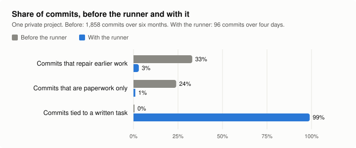

# runner-kit

A protocol for setting up a powerful coding agent runner infrastructure that reduces token usage and ensures output quality across multi-sessions. It runs off one coordinating task and can be used with any coding agent to work through a written list of tasks, unattended, one fresh session per task, with the rules that matter enforced by code at commit time.

## Why this exists

The kit came out of one private project. For six months the project was built in long coding sessions, each asked to carry a plan of several phases from start to finish. The git history of that period, 1,858 commits, shows what that produced:

- About one commit in three (33%) repaired earlier work. Its subject line used a word such as fix, repair, revert or restore.
- About one in four (24%) changed no code at all: plans, coordination notes and evidence files written by sessions about their own work.
- No commit named a written task. There was no list to check a commit against.
- One commit in six (16%) changed more than 500 lines.

The runner replaced those sessions with a written queue of small tasks, one fresh session per task, and rules checked by code when a session commits. In the first four days with the rules enforced (96 commits):

- 3% of commits repaired earlier work, and 1% were paperwork only.
- 99% began with the id of the task they delivered.
- 126 tasks were run in 147 task runs (counted later the same day). 87% of those runs ended in a finished task, and a task took 1.16 sessions on average. The median finished task took about 13 minutes.

What did the work, on this project's record:

- **Small written tasks and a fresh session for each.** In the six days before the commit hook existed, with the queue and the task file already in use, 74% of task runs ended in a finished task and a task took 1.39 sessions. In the four days after, 87% and 1.16. The hook arrived on the same day as a rewritten session prompt and the single reviewer, so the rise cannot be put down to any one of them.
- **One reviewer on every diff.** It reported at least one defect in about four of every five task commits, 3.6 on average for the largest tasks, and the session fixed or answered each before committing.
- **The commit hook is a backstop.** In those four days it refused a commit in 2 of 146 sessions.
- **The gap was something nobody checked.** Over more than three days, thirteen task commits each noted that tests were already failing before their change, and carried on; nothing told the owner. The runner now runs the project's own check itself, before each task and on each task's commit (`CHECK_CMD`).

How to read these numbers:

- They come from one project and one owner, and the runner period is four days. Treat them as a record of what happened, not a benchmark.
- "Repaired earlier work" is counted from words in commit subjects. It misses repairs described another way and counts some new work that mentions a fix.
- Token use before the runner was not measured, so this page makes no claim about tokens saved. With the runner, the median task session used about 7 million tokens with its reviewer, 97% of them cached re-reads of the same context. A session re-reads everything it holds on every turn, so what it holds at the start is paid for about forty times. Half of that starting load was descriptions of tools no task session ever called; the kit now starts Claude Code sessions with the five tools they use (`CLAUDE_TOOLS`), which measured 14,000 tokens lighter per turn, an estimated tenth of all tokens in that project.
- The two periods differ in more than the runner: the work itself changed, and so did the models.
- Every figure on this page can be recounted from the project's git history and the runner's own logs.

## What it is

- **A protocol** (`PROTOCOL.md`): who does what, how a task is written, how the queue runs, what happens when a task stops, and when something counts as live.
- **Two scripts with no model in them**: `bin/run_queue.sh` walks the queue and `bin/run_task.sh` runs one task to its commit, retrying and resuming on its own.
- **Commit checks** (`bin/runner_checks.py`): a git pre-commit hook that refuses, for example, a new file the task does not name or a function nothing calls.
- **The project's own check, run by the runner** (`CHECK_CMD`): your test command, run before each task and again on its commit. A commit that breaks it sends the same session back to repair it. The session's word that the tests pass is not taken.
- **A pause when the system is at fault**: three different tasks stopping one after another pause the queue and tell the owner, instead of spending a session on every task left.
- **A record of what each session used** (`runs/usage.log`): minutes, turns, tokens and cost per session, beside its letter and effort, so the cost of a choice of model can be seen and not guessed.
- **Adapters** (`adapters/`): one file per agent. Claude Code and Codex are included; `adapters/TEMPLATE.sh` is the contract for adding another.
- **Notifiers** (`notify/`): log only, a desktop notice, or your own command.

The person the work is for is called the owner. The owner sets outcomes and answers product questions once, in writing. Everything else is delegated.

## Install: one step

Open `INSTALL-PROMPT.md`, copy everything below its line, and paste it into your coding agent, started in your project. The agent clones the kit, reads `manifest.yaml`, `interview.yaml` and `PROTOCOL.md`, asks you only what it cannot find out itself, installs, and runs the self-test. It must not report success unless the self-test prints `SELFTEST: PASS`.

To check a machine by hand: `bin/runner-doctor`. To run the self-test by hand: `selftest/run.sh --adapter claude --model <model id>`, or `selftest/run.sh --no-agent` on a machine with no signed-in agent. With `--no-agent` it still proves every commit check and the runner's own logic, using a stand-in session that spends nothing; only the one real task is skipped.

## Requirements

- git
- python3, 3.9 or newer (standard library only)
- zsh, 5 or newer. The scripts are zsh and are not ported to another shell.
- tmux, to run the queue unattended
- At least one supported agent command-line tool, installed and signed in: Claude Code (`claude`) or Codex (`codex`)

## What is proven and what is not

`manifest.yaml` holds the full record, under `adapters` and `status`. In short:

- **Proven, on macOS, with the Claude Code adapter:** the self-test passes, all fourteen lines. One real task runs to its commit with one reviewer, under the five-tool list. Every commit check refuses the change it exists to refuse, and a clean commit is accepted. With a stand-in session that spends nothing, the runner's own logic is proven: the done test, the project's check sending a session back, a stop session, parking and release, the pause after three stops, the stop file. Each of those lines was also shown to fail when its behaviour is switched off. The queue has also run one real task from start to finish.
- **Experimental: the Codex adapter.** Its review step can be refused by Codex's own approval reviewer, and its resume and failure handling through the runner are untested. Nothing has been run through the adapter file as it stands in this kit.
- **Not proven:** Linux; a stop session and a resumed session with a real agent (both are proven only with the stand-in); usage-limit and network-error handling; `CHECK_CMD` against a real project's test suite; a project with more than one code repository; the `deploy.sh` skeleton against a real host.

Task sessions run unattended and may run shell commands in the repositories you name. Read `PROTOCOL.md` before you start a queue.

## Credit

[governed-dev-kit](https://github.com/5h4rdy/governed-dev-kit) reached the same problem from the other side: a written method first, a reviewing agent that owns quality, and a commit hook after. Version 0.2 of this kit takes three things from it, each changed to fit a runner with no model in its scripts.

- **A proof for every check.** Its self-test makes one violating commit per check and confirms the refusal. This kit's self-test used to prove one check of seven. It now proves each one, one accepted commit, and the runner's own logic with a stand-in session.
- **Gates run independently.** Its reviewer re-runs the test suite and does not take the implementer's word. Here the runner does that itself, as `CHECK_CMD`.
- **Three unproductive runs are a fault in the system.** Here that is the pause after three different tasks stop in a row.

Reading that kit against this one is also what led to measuring where the tokens go.

Considered and not taken, with the reason for each:

- A `Task-Files:` line in the commit message. The committing session writes it, so it checks the session against itself. This kit checks against the task text, which the session did not write.
- A rule that code commits must include a test file, and tests written before code as a law. An empty test satisfies the first, and this kit's done-when check runs on real or copied data. Where a project wants test-first work, it says so in its own rules.
- Approval of a plan before any edit. This kit asks the owner product questions only.
- Tracing each value across module boundaries in review. It earns its keep where separate agents write the two sides at once. Here one session writes against code it can read, and the one reviewer already reported such faults unprompted, so the extra reading on every task was not worth its tokens.
- Running independent tasks at the same time. In the project this kit came from the queue stood idle for about half of the four days, so the queue was not the limit.
- More than one reviewer, and review passes for design patterns or file size. One reviewer found defects in four of every five diffs; nothing measured says a second pass would pay for itself.

## Licence

GNU General Public License, version 3. See `LICENSE`.
